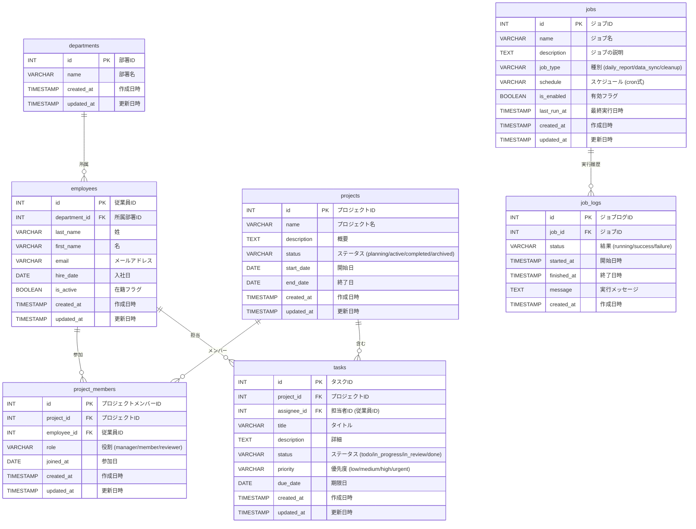

# データベース定義書

プロジェクト管理システムを題材としたデータベース。

## 概要

| リレーション | 例 |
|---|---|
| 一対多 | 部署 → 従業員, プロジェクト → タスク |
| 多対多 | 従業員 ↔ プロジェクト (中間テーブル: project_members) |
| ジョブ | jobs テーブル + job_logs テーブル |

---

## ER図 (概要: PK・FK のみ)

---

## ER図 (詳細)

---

## テーブル定義

### departments (部署)

| カラム名 | 型 | NULL | デフォルト | 説明 |
|---|---|---|---|---|
| id | SERIAL | NO | (自動採番) | PK |
| name | VARCHAR(100) | NO | | 部署名 |
| created_at | TIMESTAMP | NO | CURRENT_TIMESTAMP | 作成日時 |
| updated_at | TIMESTAMP | NO | CURRENT_TIMESTAMP | 更新日時 |

**サンプルデータ** (全10件)

| id | name | created_at | updated_at |
|---|---|---|---|
| 1 | 経営企画部 | 2025-01-01 09:00:00 | 2025-01-01 09:00:00 |
| 2 | 開発部 | 2025-01-01 09:00:00 | 2025-01-01 09:00:00 |
| 3 | 営業部 | 2025-01-01 09:00:00 | 2025-01-01 09:00:00 |
| 4 | 人事部 | 2025-01-01 09:00:00 | 2025-01-01 09:00:00 |
| 5 | カスタマーサポート部 | 2025-01-01 09:00:00 | 2025-01-01 09:00:00 |
| 6 | 経理部 | 2025-01-01 09:00:00 | 2025-01-01 09:00:00 |
| 7 | 総務部 | 2025-01-01 09:00:00 | 2025-01-01 09:00:00 |
| 8 | マーケティング部 | 2025-01-01 09:00:00 | 2025-01-01 09:00:00 |
| 9 | 品質管理部 | 2025-01-01 09:00:00 | 2025-01-01 09:00:00 |
| 10 | 情報システム部 | 2025-01-01 09:00:00 | 2025-01-01 09:00:00 |

### employees (従業員)

| カラム名 | 型 | NULL | デフォルト | 説明 |
|---|---|---|---|---|
| id | SERIAL | NO | (自動採番) | PK |
| department_id | INT | NO | | FK → departments.id |
| last_name | VARCHAR(50) | NO | | 姓 |
| first_name | VARCHAR(50) | NO | | 名 |
| email | VARCHAR(255) | NO | | メールアドレス (UNIQUE) |
| hire_date | DATE | NO | | 入社日 |
| is_active | BOOLEAN | NO | TRUE | 在籍フラグ |
| created_at | TIMESTAMP | NO | CURRENT_TIMESTAMP | 作成日時 |
| updated_at | TIMESTAMP | NO | CURRENT_TIMESTAMP | 更新日時 |

**サンプルデータ** (全100件、先頭5件を抜粋)

| id | department_id | last_name | first_name | email | hire_date | is_active |
|---|---|---|---|---|---|---|
| 1 | 1 | 岡本 | 悠真 | emp0001@example.com | 2025-09-08 | TRUE |
| 2 | 1 | 金子 | 湊 | emp0002@example.com | 2025-03-31 | TRUE |
| 3 | 1 | 佐藤 | 拓海 | emp0003@example.com | 2025-08-27 | TRUE |
| 32 | 3 | 木村 | 太郎 | emp0032@example.com | 2025-08-14 | FALSE |
| 95 | 10 | 木村 | 竜也 | emp0095@example.com | 2025-08-08 | FALSE |

> 部署ごとの人数: 経営企画部 5名、開発部 25名、営業部 20名、人事部 5名、カスタマーサポート部 10名、経理部 8名、総務部 5名、マーケティング部 10名、品質管理部 5名、情報システム部 7名。退職者 (`is_active = FALSE`) を含む。

### projects (プロジェクト)

| カラム名 | 型 | NULL | デフォルト | 説明 |
|---|---|---|---|---|
| id | SERIAL | NO | (自動採番) | PK |
| name | VARCHAR(200) | NO | | プロジェクト名 |
| description | TEXT | YES | | 概要 |
| status | VARCHAR(20) | NO | 'planning' | planning / active / completed / archived |
| start_date | DATE | YES | | 開始日 |
| end_date | DATE | YES | | 終了日 |
| created_at | TIMESTAMP | NO | CURRENT_TIMESTAMP | 作成日時 |
| updated_at | TIMESTAMP | NO | CURRENT_TIMESTAMP | 更新日時 |

**サンプルデータ** (全20件、先頭5件を抜粋)

| id | name | description | status | start_date | end_date |
|---|---|---|---|---|---|
| 1 | 社内ポータルリニューアル | 老朽化した社内ポータルサイトを刷新する | active | 2026-02-19 | 2026-08-12 |
| 2 | モバイルアプリ開発 | 顧客向けモバイルアプリの新規開発 | completed | 2025-01-28 | 2025-11-15 |
| 3 | 営業支援ツール導入 | SFA ツールの選定・導入・研修 | completed | 2025-05-19 | 2026-04-10 |
| 7 | 社内チャットシステム導入 | 社内コミュニケーション基盤を刷新 | archived | 2025-09-16 | 2026-01-25 |
| 17 | ワークフローシステム導入 | 申請・承認ワークフローの電子化 | active | 2026-06-30 | 2026-12-31 |

> ステータス内訳: planning 0件、active 8件、completed 6件、archived 4件 (※ planning のプロジェクトは未投入)。

### project_members (プロジェクトメンバー)

多対多の中間テーブル。`(project_id, employee_id)` に UNIQUE 制約。

| カラム名 | 型 | NULL | デフォルト | 説明 |
|---|---|---|---|---|
| id | SERIAL | NO | (自動採番) | PK |
| project_id | INT | NO | | FK → projects.id |
| employee_id | INT | NO | | FK → employees.id |
| role | VARCHAR(20) | NO | 'member' | manager / member / reviewer |
| joined_at | DATE | NO | CURRENT_DATE | 参加日 |
| created_at | TIMESTAMP | NO | CURRENT_TIMESTAMP | 作成日時 |
| updated_at | TIMESTAMP | NO | CURRENT_TIMESTAMP | 更新日時 |

**サンプルデータ** (全120件、先頭5件を抜粋)

| id | project_id | employee_id | role | joined_at |
|---|---|---|---|---|
| 1 | 1 | 63 | manager | 2026-02-26 |
| 2 | 1 | 59 | reviewer | 2026-03-09 |
| 3 | 1 | 98 | reviewer | 2026-03-01 |
| 4 | 1 | 79 | member | 2026-03-06 |
| 5 | 1 | 37 | member | 2026-02-24 |

> 各プロジェクトに 3〜10 名のメンバーが所属。role は manager / member / reviewer の 3 種。

### tasks (タスク)

| カラム名 | 型 | NULL | デフォルト | 説明 |
|---|---|---|---|---|
| id | SERIAL | NO | (自動採番) | PK |
| project_id | INT | NO | | FK → projects.id |
| assignee_id | INT | YES | | FK → employees.id (担当者) |
| title | VARCHAR(300) | NO | | タイトル |
| description | TEXT | YES | | 詳細 |
| status | VARCHAR(20) | NO | 'todo' | todo / in_progress / in_review / done |
| priority | VARCHAR(10) | NO | 'medium' | low / medium / high / urgent |
| due_date | DATE | YES | | 期限日 |
| created_at | TIMESTAMP | NO | CURRENT_TIMESTAMP | 作成日時 |
| updated_at | TIMESTAMP | NO | CURRENT_TIMESTAMP | 更新日時 |

**サンプルデータ** (全260件、先頭5件を抜粋)

| id | project_id | assignee_id | title | status | priority | due_date |
|---|---|---|---|---|---|---|
| 1 | 1 | 63 | 結合テスト | done | medium | 2026-07-06 |
| 2 | 1 | 59 | パフォーマンステスト | done | low | 2026-06-06 |
| 3 | 1 | 98 | 運用監視設定 | done | urgent | 2026-04-20 |
| 4 | 1 | 63 | ドキュメント整備 | done | medium | 2026-04-23 |
| 5 | 1 | 34 | データ移行 | done | high | 2026-04-17 |

> ステータス内訳: todo / in_progress / in_review / done。優先度: low / medium / high / urgent。各プロジェクトに複数タスクが紐づく。

### jobs (ジョブ)

定期実行バッチなどのジョブ定義。

| カラム名 | 型 | NULL | デフォルト | 説明 |
|---|---|---|---|---|
| id | SERIAL | NO | (自動採番) | PK |
| name | VARCHAR(100) | NO | | ジョブ名 |
| description | TEXT | YES | | ジョブの説明 |
| job_type | VARCHAR(30) | NO | | daily_report / data_sync / cleanup |
| schedule | VARCHAR(100) | YES | | cron 式 (例: `0 9 * * *`) |
| is_enabled | BOOLEAN | NO | TRUE | 有効フラグ |
| last_run_at | TIMESTAMP | YES | | 最終実行日時 |
| created_at | TIMESTAMP | NO | CURRENT_TIMESTAMP | 作成日時 |
| updated_at | TIMESTAMP | NO | CURRENT_TIMESTAMP | 更新日時 |

**サンプルデータ** (全10件)

| id | name | job_type | schedule | is_enabled |
|---|---|---|---|---|
| 1 | 日次プロジェクトレポート | daily_report | 0 9 * * 1-5 | TRUE |
| 2 | 従業員マスタ同期 | data_sync | 0 2 * * * | TRUE |
| 3 | 完了タスククリーンアップ | cleanup | 0 3 1 * * | TRUE |
| 4 | 旧ジョブログ削除 | cleanup | 0 4 1 * * | FALSE |
| 5 | 日次バックアップ | data_sync | 0 1 * * * | TRUE |
| 6 | 週次集計レポート | daily_report | 0 8 * * 1 | TRUE |
| 7 | 月次請求データ生成 | daily_report | 0 6 1 * * | TRUE |
| 8 | 未読通知リマインダー | daily_report | 0 10 * * 1-5 | FALSE |
| 9 | 一時ファイル削除 | cleanup | 0 5 * * 0 | FALSE |
| 10 | 外部 API トークン更新 | data_sync | 0 0 1 * * | TRUE |

> job_type 内訳: daily_report 4件、data_sync 3件、cleanup 3件。無効化 (`is_enabled = FALSE`) されたジョブを含む。

### job_logs (ジョブ実行ログ)

| カラム名 | 型 | NULL | デフォルト | 説明 |
|---|---|---|---|---|
| id | SERIAL | NO | (自動採番) | PK |
| job_id | INT | NO | | FK → jobs.id |
| status | VARCHAR(20) | NO | | running / success / failure |
| started_at | TIMESTAMP | NO | | 開始日時 |
| finished_at | TIMESTAMP | YES | | 終了日時 |
| message | TEXT | YES | | 実行メッセージ / エラー内容 |
| created_at | TIMESTAMP | NO | CURRENT_TIMESTAMP | 作成日時 |

**サンプルデータ** (全500件、先頭5件を抜粋)

| id | job_id | status | started_at | finished_at | message |
|---|---|---|---|---|---|
| 1 | 1 | success | 2025-06-28 05:00:00 | 2025-06-28 05:02:19 | レポート送信完了: 3 プロジェクト |
| 2 | 1 | success | 2025-07-09 05:00:00 | 2025-07-09 05:00:44 | レポート送信完了: 18 プロジェクト |
| 3 | 1 | success | 2025-07-20 06:00:00 | 2025-07-20 06:01:26 | レポート生成・送信完了 |
| 9 | 1 | failure | 2025-08-23 00:00:00 | 2025-08-23 00:00:10 | ディスク容量不足 |
| 10 | 1 | success | 2025-09-03 01:00:00 | 2025-09-03 01:02:55 | レポート送信完了: 16 プロジェクト |

> ステータス内訳: success / failure / running。各ジョブに対して複数の実行ログが時系列で記録される。failure レコードには障害内容が message に格納される。

---

## リレーション一覧

| 種別 | 関係 | 説明 |
|---|---|---|
| 一対多 | departments → employees | 1つの部署に複数の従業員が所属 |
| 一対多 | projects → tasks | 1つのプロジェクトに複数のタスクが紐づく |
| 一対多 | employees → tasks | 1人の従業員が複数のタスクを担当 |
| 一対多 | jobs → job_logs | 1つのジョブに複数の実行ログが紐づく |
| 多対多 | employees ↔ projects | 中間テーブル project_members を介して多対多 |
