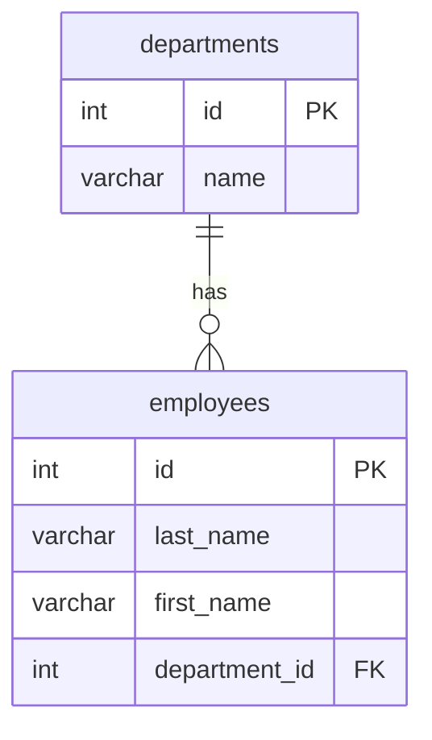
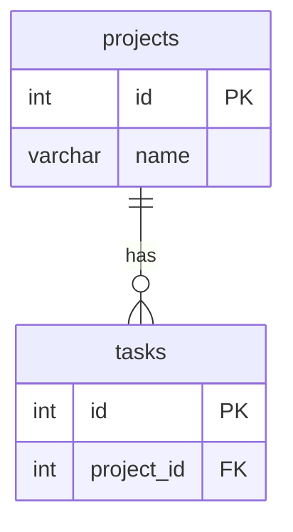
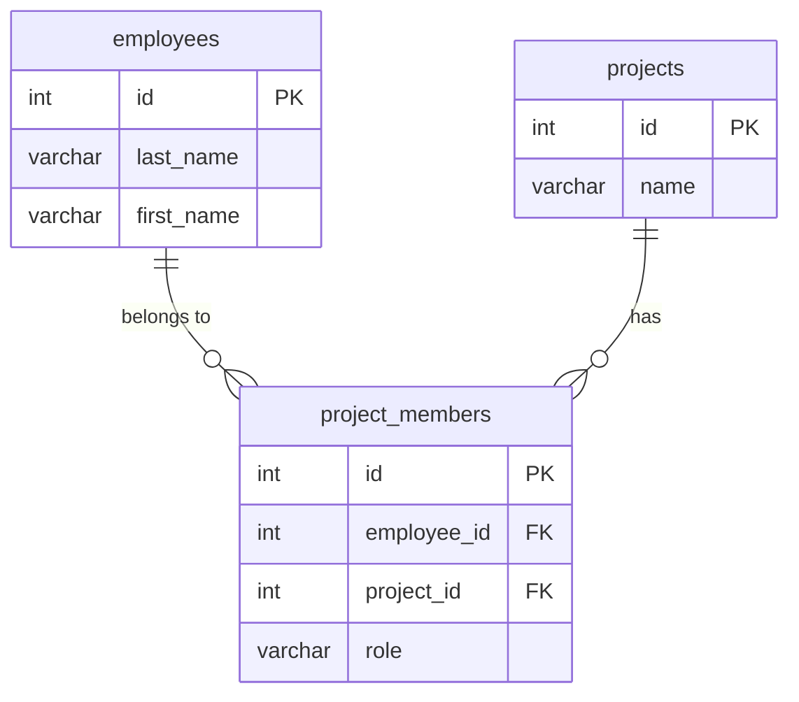

# SELECT 応用

JOIN、サブクエリ、CASE 式など、複数テーブルを活用した応用的な SELECT パターンを学びます。

## 15. INNER JOIN

**ファイル:** `sql/1-select/14-inner-join.sql`

2つのテーブルを結合し、両方に一致するレコードを取得します。

`INNER JOIN` は、結合条件（`ON` 句）を満たすレコードだけを両テーブルから取得します。どちらかのテーブルに対応するレコードが存在しない行は結果に含まれません。テーブルにエイリアス（`e`、`d` など）を付けると、カラム名の衝突を避けつつ記述を簡潔にできます。



```sql
-- INNER JOIN
-- 従業員と所属部署名を結合して取得する
SELECT
    e.id,
    e.last_name,
    e.first_name,
    d.name AS department_name
FROM employees e
INNER JOIN departments d ON e.department_id = d.id;
```

## 16. LEFT JOIN

**ファイル:** `sql/1-select/15-left-join.sql`

左側テーブルの全レコードを保持しつつ、右側テーブルと結合します。

`LEFT JOIN` は左側（`FROM` 句）のテーブルの全行を結果に含め、右側に一致する行がない場合は NULL で埋めます。「データが存在しない」ケースも含めて一覧を作りたいときに便利です。たとえばタスクが0件のプロジェクトも含めた集計が可能になります。

```sql
-- LEFT JOIN
-- プロジェクトごとのタスク数を取得する (タスクがないプロジェクトも含む)
SELECT
    p.id,
    p.name AS project_name,
    COUNT(t.id) AS task_count
FROM projects p
LEFT JOIN tasks t ON p.id = t.project_id
GROUP BY p.id, p.name
ORDER BY task_count DESC;
```

### INNER JOIN と LEFT JOIN の結果の違い

たとえば以下のデータがある場合、`COUNT` の結果が JOIN の種類によって異なります。



**projects テーブル:**

| id | name |
|---|---|
| 1 | Project A |
| 2 | Project B |
| 3 | Project C |

**tasks テーブル:**

| id | project_id |
|---|---|
| 101 | 1 |
| 102 | 1 |
| 103 | 1 |
| 104 | 2 |

Project A にはタスクが3件、Project B には1件、Project C には0件あります。

**INNER JOIN + COUNT の結果（タスクがあるプロジェクトのみ）:**

| project_name | task_count |
|---|---|
| Project A | 3 |
| Project B | 1 |

**LEFT JOIN + COUNT の結果（全プロジェクトを保持）:**

| project_name | task_count |
|---|---|
| Project A | 3 |
| Project B | 1 |
| Project C | 0 |

`INNER JOIN` では タスクが0件の Project C が結果から消えますが、`LEFT JOIN` では `task_count = 0` として残ります。

## 17. 複数テーブルの JOIN

**ファイル:** `sql/1-select/16-multi-join.sql`

3つ以上のテーブルを連続して結合し、関連データをまとめて取得します。

`JOIN` は複数回チェーンすることで、3つ以上のテーブルを1つのクエリで結合できます。中間テーブル（ここでは `project_members`）を起点にして、両側のマスタテーブル（`employees`、`projects`）を結合する多対多リレーションの解決は典型的なパターンです。



```sql
-- 複数テーブルの JOIN
-- プロジェクトメンバーの一覧を取得する
SELECT
    e.last_name || ' ' || e.first_name AS employee_name,
    p.name AS project_name,
    pm.role
FROM project_members pm
INNER JOIN employees e ON pm.employee_id = e.id
INNER JOIN projects p ON pm.project_id = p.id
ORDER BY p.name, pm.role;
```

## 18. サブクエリ (WHERE 句)

**ファイル:** `sql/1-select/17-subquery-where.sql`

WHERE 句の中に別のクエリを埋め込んで、動的な条件で絞り込みます。

サブクエリ（副問い合わせ）は、クエリの中に入れ子にした別のクエリです。`WHERE` 句で使うと、別テーブルの検索結果を条件値として利用できます。サブクエリが1行だけ返す場合は `=` で比較でき、複数行返す場合は `IN` や `EXISTS` を使います。

```sql
-- サブクエリ (WHERE 句)
-- 開発部に所属する従業員を取得する
SELECT id, last_name, first_name
FROM employees
WHERE department_id = (
    SELECT id FROM departments WHERE name = '開発部'
);
```

> **注意:** `=` で比較する場合、サブクエリは必ず **1行だけ** を返す必要があります。サブクエリが複数行を返すと実行時エラーになります。複数行が返る可能性がある場合は、`IN`（セクション18）や `EXISTS`（セクション19）を使ってください。

## 19. サブクエリ (IN)

**ファイル:** `sql/1-select/18-subquery-in.sql`

サブクエリが返す複数の値に一致するレコードを取得します。

`IN` 句の中にサブクエリを使うと、別テーブルの検索結果に含まれる値と一致するレコードを動的に取得できます。固定のリストではなくクエリ結果でフィルタリングするため、データの変化に自動的に追従します。サブクエリ内でさらに `JOIN` を使って複雑な条件を構築することも可能です。

```sql
-- サブクエリ (IN)
-- active なプロジェクトに参加している従業員を取得する
SELECT DISTINCT e.id, e.last_name, e.first_name
FROM employees e
WHERE e.id IN (
    SELECT pm.employee_id
    FROM project_members pm
    INNER JOIN projects p ON pm.project_id = p.id
    WHERE p.status = 'active'
);
```

## 20. EXISTS

**ファイル:** `sql/1-select/19-exists.sql`

相関サブクエリの結果が存在するかどうかで絞り込みます。

`EXISTS` はサブクエリが1行でも結果を返すかどうかを真偽値で判定します。外側のクエリの各行に対してサブクエリが評価される「相関サブクエリ」の形で使うのが一般的です。`IN` と似た結果を得られますが、サブクエリが大量の行を返す場合やインデックスが効く場合に `EXISTS` の方が高速になることがあります。

```sql
-- EXISTS
-- プロジェクトに 1 つ以上参加している従業員を取得する
SELECT e.id, e.last_name, e.first_name
FROM employees e
WHERE EXISTS (
    SELECT 1 FROM project_members pm WHERE pm.employee_id = e.id
);
```

## 21. WITH (CTE) の基本構造

**ファイル:** `sql/1-select/21-basic-cte.sql`

サブクエリに名前を付けて、クエリの可読性を向上させます。

`WITH` 句（Common Table Expression）を使うと、サブクエリに名前を付けて一時的なテーブルのように参照できます。基本構造は `WITH 名前 AS (サブクエリ) SELECT ... FROM 名前` です。ネストの深いサブクエリを平坦に書き直せるため、複雑なクエリの見通しが大幅に良くなります。CTE の結果は通常のテーブルと同じように `WHERE` や `JOIN` で利用できます。

```sql
-- WITH (CTE) の基本構造
-- active なプロジェクトの一覧を CTE で定義し、そこから取得する
WITH active_projects AS (
    SELECT id, name, start_date
    FROM projects
    WHERE status = 'active'
)
SELECT name, start_date
FROM active_projects
ORDER BY start_date;
```

## 22. WITH (CTE) の実践

**ファイル:** `sql/1-select/22-practical-cte.sql`

CTE を使って集計結果に名前を付け、複雑なクエリを段階的に組み立てます。

CTE の実践的な利点は、複数のステップに分けてクエリを構築できることです。たとえば、まず集計を行い、その結果を別のテーブルと結合するといった処理を、読みやすい順序で記述できます。また、同じ CTE を1つのクエリ内で複数回参照することもでき、同じサブクエリを繰り返し書く必要がなくなります。

```sql
-- WITH (CTE) の実践
-- 部署ごとの従業員数を集計し、部署名と合わせて取得する
WITH dept_employee_count AS (
    SELECT
        department_id,
        COUNT(*) AS employee_count
    FROM employees
    GROUP BY department_id
)
SELECT
    d.name AS department_name,
    COALESCE(c.employee_count, 0) AS employee_count
FROM departments d
LEFT JOIN dept_employee_count c ON d.id = c.department_id
ORDER BY employee_count DESC;
```

## 23. CASE 式 (SELECT カラム)

**ファイル:** `sql/1-select/23-case-select.sql`

CASE 式を SELECT リストで使い、値を別の表現に変換します。

`CASE` 式は SQL における条件分岐です。`CASE column WHEN value THEN result END` の単純形式と、`CASE WHEN condition THEN result END` の検索形式の2種類があります。SELECT リストで使うと、コード値を日本語ラベルや区分名に変換して表示できます。`ELSE` を省略すると、どの条件にも一致しない場合は NULL になります。

```sql
-- CASE 式 (SELECT カラム)
-- タスクの優先度を日本語で表示する
SELECT
    id,
    title,
    CASE priority
        WHEN 'urgent' THEN '緊急'
        WHEN 'high'   THEN '高'
        WHEN 'medium' THEN '中'
        WHEN 'low'    THEN '低'
    END AS priority_label,
    status
FROM tasks;
```

## 24. CASE 式 (ORDER BY)

**ファイル:** `sql/1-select/24-case-order-by.sql`

CASE 式を ORDER BY で使い、任意の順序でソートします。

`ORDER BY` 句に `CASE` 式を置くと、カラムの値そのものではなく、条件に応じた数値でソート順を制御できます。たとえば優先度を「urgent → high → medium → low」のようなビジネスロジック上の順序で並べたい場合に有効です。アルファベット順や数値の大小では表現できない独自のソート順を定義できます。

```sql
-- CASE 式 (ORDER BY)
-- タスクを優先度のビジネスロジック順にソートする
SELECT id, title, priority, status
FROM tasks
ORDER BY
    CASE priority
        WHEN 'urgent' THEN 1
        WHEN 'high'   THEN 2
        WHEN 'medium' THEN 3
        WHEN 'low'    THEN 4
    END;
```

## 25. 集約 + CASE (クロス集計)

**ファイル:** `sql/1-select/25-aggregate-case.sql`

集約関数と CASE を組み合わせてクロス集計（ピボット）を行います。

`COUNT` や `SUM` の中に `CASE` 式を入れることで、条件別の集計を1つのクエリで横並びに出力できます。これは行方向のデータを列方向に展開する「ピボット」と呼ばれる手法です。レポートやダッシュボード用のデータ作成でよく使われ、ステータス別・カテゴリ別の集計を一覧表形式で取得できます。

```sql
-- 集約 + CASE (クロス集計)
-- プロジェクトごとにステータス別のタスク数を集計する
SELECT
    p.name AS project_name,
    COUNT(*) AS total,
    COUNT(CASE WHEN t.status = 'todo' THEN 1 END) AS todo,
    COUNT(CASE WHEN t.status = 'in_progress' THEN 1 END) AS in_progress,
    COUNT(CASE WHEN t.status = 'in_review' THEN 1 END) AS in_review,
    COUNT(CASE WHEN t.status = 'done' THEN 1 END) AS done
FROM projects p
INNER JOIN tasks t ON p.id = t.project_id
GROUP BY p.id, p.name
ORDER BY p.name;
```

---

← [前へ: SELECT 基礎](1-basic-select.md) | [BASIC](README.md) | [次へ: INSERT](3-insert.md) →
