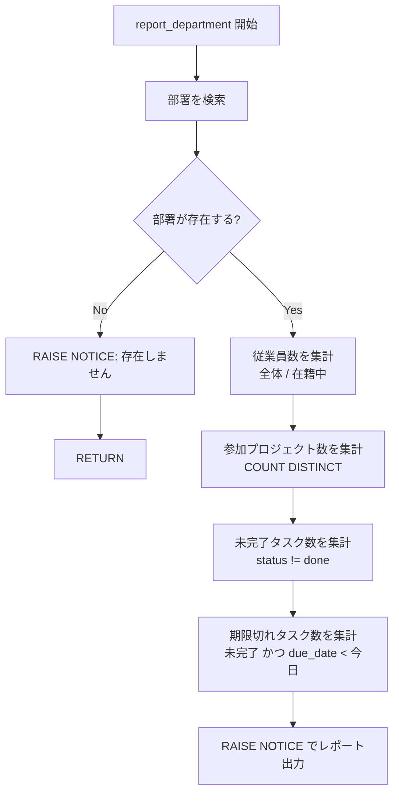

# 課題 1: 部署別レポート

難易度: ★☆☆

## 目標

指定した部署の従業員数、参加プロジェクト数、未完了タスク数、期限切れタスク数などの詳細情報を集計し、`RAISE NOTICE` でレポートとして出力する関数を作成する。

## 要件

1. 部署 ID を引数として受け取り、該当部署の詳細レポートを出力する
2. 指定された部署が存在しない場合は `RAISE NOTICE` でメッセージを表示して処理を終了する
3. 従業員数（全体・在籍中）を集計する
4. 部署のメンバーが参加しているプロジェクト数を重複なしで集計する
5. 未完了タスク数（ステータスが `done` 以外）を集計する
6. 期限切れタスク数（未完了かつ `due_date` が過去日）を集計する
7. 集計結果を `RAISE NOTICE` で整形して出力する

## 使用する知識

- `SELECT INTO` による変数への値の格納
- `IF` / `IF NOT FOUND` による条件分岐
- `FOUND` 特殊変数によるクエリ結果の判定
- `RAISE NOTICE` によるメッセージ出力
- `COUNT(*) FILTER (WHERE ...)` による条件付き集計
- `COUNT(DISTINCT ...)` による重複排除カウント

## 解答例

**ファイル:** [sql/1-department-report/1-department-report.sql](sql/1-department-report/1-department-report.sql)

---

[PRACTICE](README.md) | [次へ](2-project-dashboard.md) →
