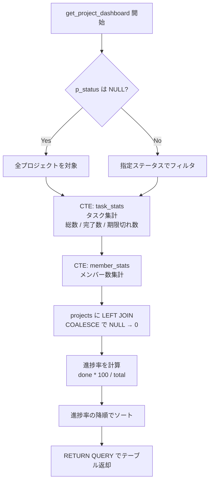

# 課題 2: プロジェクトダッシュボード

難易度: ★★☆

## 目標

全プロジェクトの進捗状況（メンバー数、タスク数、完了率、期限切れタスク数）を一覧として返すテーブル返却関数を作成する。オプションでステータスによるフィルタリングも行えるようにする。

## 要件

1. プロジェクトのステータス（任意）を引数として受け取り、該当するプロジェクトの進捗一覧をテーブルとして返す
2. 引数が `NULL` の場合は全プロジェクトを返す
3. 各プロジェクトについて、メンバー数・総タスク数・完了タスク数・進捗率（%）・期限切れタスク数を集計する
4. タスクやメンバーが存在しない場合は `COALESCE` で 0 を返す
5. 進捗率の降順でソートして返す
6. CTE（Common Table Expression）を使ってクエリを構造化する

## 使用する知識

- `RETURNS TABLE` によるテーブル返却関数の定義
- `RETURN QUERY` によるクエリ結果の返却
- CTE（`WITH` 句）によるクエリの構造化
- `COALESCE` による NULL の安全な処理
- `COUNT(*) FILTER (WHERE ...)` による条件付き集計
- `LEFT JOIN` による欠損データへの対応
- `DEFAULT` パラメータによるオプション引数

## 解答例

**ファイル:** [sql/2-project-dashboard/1-project-dashboard.sql](sql/2-project-dashboard/1-project-dashboard.sql)

---

← [前へ](1-department-report.md) | [PRACTICE](README.md) | [次へ](3-employee-transfer.md) →
