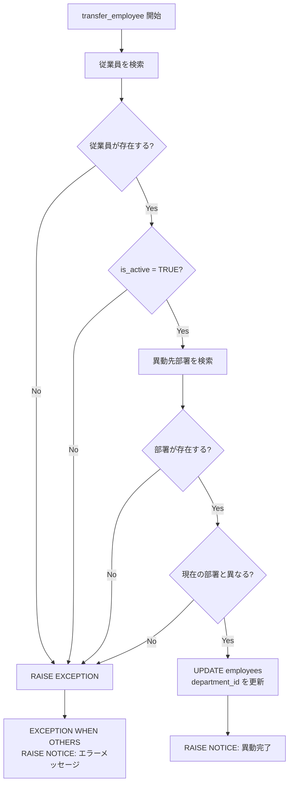

# 課題 3: 従業員異動処理

難易度: ★★☆

## 目標

従業員を別の部署に異動させる関数を作成する。異動前に複数のバリデーション（存在チェック、在籍チェック、同一部署チェック）を行い、エラーが発生した場合は `EXCEPTION` ブロックで安全にハンドリングする。

## 要件

1. 従業員 ID と異動先部署 ID を引数として受け取る
2. 従業員が存在しない場合は `RAISE EXCEPTION` でエラーを発生させる
3. 従業員が退職済み（`is_active = FALSE`）の場合はエラーを発生させる
4. 異動先の部署が存在しない場合はエラーを発生させる
5. 現在の所属部署と異動先が同じ場合はエラーを発生させる
6. 全てのバリデーションに通過した場合、`employees` テーブルの `department_id` を更新する
7. 異動完了メッセージを `RAISE NOTICE` で出力する
8. `EXCEPTION WHEN OTHERS` ブロックでエラーをキャッチし、メッセージを表示する

## 使用する知識

- バリデーション（複数の事前チェック）の実装パターン
- `RAISE EXCEPTION` によるエラーの発生
- `EXCEPTION WHEN OTHERS` ブロックによるエラーハンドリング
- `SQLERRM` による エラーメッセージの取得
- `SELECT INTO` と `FOUND` による存在チェック
- `RECORD` 型を使った複数カラムの取得

## 解答例

**ファイル:** [sql/3-employee-transfer/1-employee-transfer.sql](sql/3-employee-transfer/1-employee-transfer.sql)

---

← [前へ](2-project-dashboard.md) | [PRACTICE](README.md) | [次へ](4-task-auto-assign.md) →
