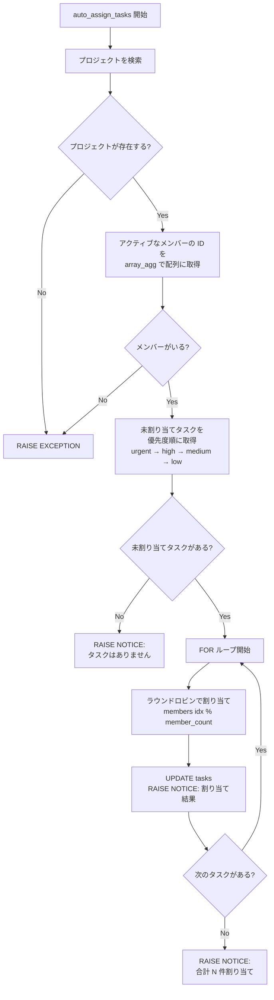

# 課題 4: タスク自動割り当て

難易度: ★★★

## 目標

指定したプロジェクトの未割り当てタスクを、プロジェクトのアクティブなメンバーにラウンドロビン方式で自動的に割り当てる関数を作成する。タスクは優先度順に処理される。

## 要件

1. プロジェクト ID を引数として受け取る
2. プロジェクトが存在しない場合は `RAISE EXCEPTION` でエラーを発生させる
3. プロジェクトにアクティブなメンバーがいない場合はエラーを発生させる
4. アクティブなメンバーの ID を `array_agg` で配列として取得する
5. 未割り当てタスク（`assignee_id IS NULL`）を優先度順（urgent > high > medium > low）に取得する
6. ラウンドロビン方式（インデックスを剰余演算で循環）でメンバーに割り当てる
7. 各割り当て結果を `RAISE NOTICE` で出力する
8. 未割り当てタスクがない場合はその旨を通知する

## 使用する知識

- 配列（`INT[]`）の宣言と操作
- `array_agg` による集約結果の配列化
- `array_length` による配列の長さ取得
- ラウンドロビンアルゴリズム（`%` 剰余演算）
- `FOR ... IN SELECT ... LOOP` によるカーソルループ
- `CASE` 式による優先度の数値化とソート
- `ORDER BY` 内での `CASE` 式の使用

## 解答例

**ファイル:** [sql/4-task-auto-assign/1-task-auto-assign.sql](sql/4-task-auto-assign/1-task-auto-assign.sql)

---

← [前へ](3-employee-transfer.md) | [PRACTICE](README.md) | [次へ](5-job-executor.md) →
