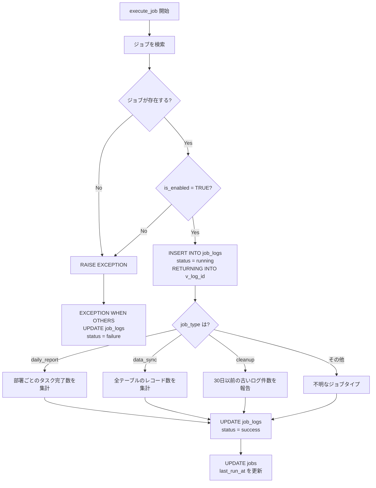

# 課題 5: ジョブ実行シミュレーター

難易度: ★★★

## 目標

ジョブの実行をシミュレートし、ジョブの種類（`job_type`）に応じた処理を `CASE` 分岐で実行する関数を作成する。実行結果は `job_logs` テーブルに記録し、エラーが発生した場合も失敗ログとして記録する。

## 要件

1. ジョブ ID を引数として受け取る
2. ジョブが存在しない場合は `RAISE EXCEPTION` でエラーを発生させる
3. ジョブが無効（`is_enabled = FALSE`）の場合はエラーを発生させる
4. 実行開始時に `job_logs` へ `running` ステータスのログを `RETURNING INTO` で挿入する
5. `job_type` に応じて `CASE` で処理を分岐する:
   - `daily_report`: 部署ごとのタスク完了数を集計する
   - `data_sync`: 全テーブルのレコード数を集計する
   - `cleanup`: 30日以前の古いジョブログの件数を報告する
   - その他: 不明なジョブタイプとしてメッセージを設定する
6. 成功時は `job_logs` のステータスを `success` に更新し、`jobs` の `last_run_at` を更新する
7. `EXCEPTION WHEN OTHERS` ブロックで失敗時のログを `failure` として記録する

## 使用する知識

- `CASE` 文（`CASE ... WHEN ... THEN ... END CASE`）による分岐処理
- `INSERT ... RETURNING INTO` によるログ ID の取得
- `EXCEPTION WHEN OTHERS` によるエラーハンドリング
- `SQLERRM` によるエラーメッセージの取得
- `FOR ... IN SELECT ... LOOP` によるカーソルループ
- `pg_stat_user_tables` システムカタログの参照
- `RECORD` 型変数の活用

## 解答例

**ファイル:** [sql/5-job-executor/1-job-executor.sql](sql/5-job-executor/1-job-executor.sql)

---

← [前へ](4-task-auto-assign.md) | [PRACTICE](README.md) | [次へ](6-monthly-summary.md) →
