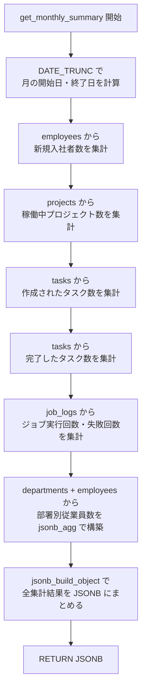

# 課題 6: 月次サマリーレポート

難易度: ★★★

## 目標

指定した年月の活動サマリー（新規入社者数、稼働プロジェクト数、タスクの作成・完了数、ジョブ実行状況、部署別内訳）を JSONB 形式で返す関数を作成する。

## 要件

1. 日付（`DATE` 型）を引数として受け取り、その月のサマリーを JSONB で返す
2. `DATE_TRUNC` を使って月の開始日と終了日を計算する
3. 以下の情報を集計する:
   - 新規入社者数（`hire_date` が対象月内の従業員）
   - 稼働中プロジェクト数（`active` ステータスで対象月に期間が重なるもの）
   - 作成されたタスク数（`created_at` が対象月内）
   - 完了したタスク数（`done` ステータスで `updated_at` が対象月内）
   - ジョブ実行回数（`started_at` が対象月内）
   - ジョブ失敗回数（上記のうち `failure` ステータス）
4. 部署ごとの従業員数（全体・アクティブ）を `jsonb_agg` で配列として構築する
5. 全ての集計結果を `jsonb_build_object` で一つの JSON オブジェクトにまとめて返す

## 使用する知識

- `RETURNS JSONB` による JSON 返却関数の定義
- `jsonb_build_object` による JSON オブジェクトの構築
- `jsonb_agg` による JSON 配列の集約
- `DATE_TRUNC` による月の開始日の計算
- `COALESCE` による NULL の安全な処理
- `TO_CHAR` による日付のフォーマット
- `COUNT(*) FILTER (WHERE ...)` による条件付き集計
- サブクエリを使った複雑な集計

## 解答例

**ファイル:** [sql/6-monthly-summary/1-monthly-summary.sql](sql/6-monthly-summary/1-monthly-summary.sql)

---

← [前へ](5-job-executor.md) | [PRACTICE](README.md)
